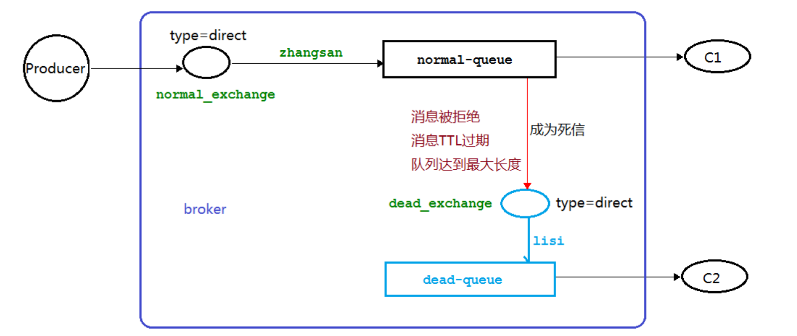

[toc]

## 死信队列

### 概念

先从概念解释上搞清楚这个定义，死信，顾名思义就是无法被消费的消息，字面意思可以这样理 解，一般来说，producer 将消息投递到 broker 或者直接到queue 里了，consumer 从queue 取出消息进行消费，但某些时候由于特定的原因导致 queue 中的**某些消息无法被消费**，这样的消息如果没有后续的处理，就变成了死信，有死信自然就有了死信队列。 

应用场景:为了**保证订单业务的消息数据不丢失**，需要使用到RabbitMQ的死信队列机制，当消息消费发生异常时，将消息投入死信队列中。

### 死信产生原因

+ 消息 TTL 过期
+ 队列达到最大长度(队列满了，无法再添加数据到 mq 中)
+ 消息被拒绝(basic.reject 或 basic.nack)并且requeue=false

### 架构图



## 延迟队列

### 概念

延时队列,队列内部是有序的，最重要的特性就体现在它的延时属性上，延时队列中的元素是希望 在指定时间到了以后或之前取出和处理，简单来说，延时队列就是用来存放需要在指定时间被处理的 元素的队列。

### 使用场景

1. 订单在十分钟之内未支付则自动取消 ；
2. 新创建的店铺，如果在十天内都没有上传过商品，则自动发送消息提醒；
3. 用户注册成功后，如果三天内没有登陆则进行短信提醒； 
4. 用户发起退款，如果三天内没有得到处理则通知相关运营人员；
5. 预定会议后，需要在预定的时间点前十分钟通知各个与会人员参加会议；

### TTL

TTL 是 RabbitMQ 中一个消息或者队列的属性，表明一条消息或者该队列中的所有消息的最大存活时间， 单位是毫秒。换句话说，如果一条消息设置了 TTL 属性或者进入了设置TTL属性的队列，那么这条消息如果在TTL设置的时间内没有被消费，则会成为"死信"。

**队列 TTL 属性**：一旦消息过期，就会被队列丢弃(如果配置了死信队列被丢到死信队列中)；

**消息 TTL 属性**：消息即使过期，也不一定会被马上丢弃，因为消息是否过期是在即将投递到消费者之前判定的，如果当前队列有严重的消息积压情况，则已过期的消息也许还能存活较长时间；

如果不设置 TTL，表示消息永远不会过期，如果将 TTL 设置为 0，则表示除非此时可以直接投递该消息到消费者，否则该消息将会被丢弃，如果同时配置了队列的TTL 和消息的 TTL，那么较小的那个值将会被使用。

### 延时队列实现

#### 使用死信（不推荐）


队列QA和QB在队列声明时设置队列TTL，可以实现延时队列的效果，但是这种方式**每增加一个新的时间需求，就要新增一个队列**，如果是预定会议室然后提前通知这样的场景，岂不是每次都要增加队列才能满足需求？

因此我们不应该在队列设置TTL，而应该在消息生产方设置消息的TTL，如QC就是一个通用的队列，队列本身并没有TTL限制，但是RabbitMQ根据进队列的先后顺序来进行消息的检查，因此**RabbitMQ 只会检查第一个消息是否过期**，如果过期则丢到死信队列， 如果第一个消息的TTL很长，而第二个消息的TTL很短，本应该在第一个消息之前执行，但是第二个消息并不会优先得到执行，这样就达不到我们想要的效果。

#### Rabbitmq 插件实现延迟队列 

##### 插件安装

在[官网](https://www.rabbitmq.com/community-plugins.html) 上下载 rabbitmq_delayed_message_exchange 插件，然后解压放置到 RabbitMQ 的插件目录。

进入 RabbitMQ 的安装目录下的 plgins 目录，执行`rabbitmq-plugins enable rabbitmq_delayed_message_exchange`让该插件生效，生效后RabbitMQ队列Type会增加一个x-delayed-message的选项。

##### 结构图


这种方式是在交换机进行延时而不是在队列中。

## 发布确认机制


1. 设置配置文件

   ```properties
   spring.rabbitmq.publisher-confirm-type: correlated # 开启发布确认模式
   spring.rabbitmq.publisher-returns: true # 开启回退功能，交换机不能将消息通过routingKey路由到指定队列时，退还消息给生产者
   ```

2. 编写回调接口（

```java
@Component
@Slf4j
public class MyCallBack implements RabbitTemplate.ConfirmCallback , RabbitTemplate.ReturnsCallback{
    @Autowired
    private RabbitTemplate rabbitTemplate;

    // 依赖注入 rabbitTemplate 之后再设置它的回调对象
    // PostConstruct注释用于需要在依赖注入完成后执行的方法，以执行任何初始化。
    // 必须在类投入服务之前调用此方法。所有支持依赖注入的类都必须支持此注释。
    // 即使类没有请求注入任何资源，也必须调用用PostConstruct注释的方法。
    // 只能使用此注释对一个方法进行注释。
    @PostConstruct
    public void init() {
        rabbitTemplate.setConfirmCallback(this);
        rabbitTemplate.setReturnsCallback(this);
    }

    /**
     * 交换机不管是否收到消息的一个回调方法
     * CorrelationData: 消息相关数据
     * ack:交换机是否收到消息
     * cause: 失败原因
     */
    @Override
    public void confirm(CorrelationData correlationData, boolean ack, String cause) {
        String id = correlationData != null ? correlationData.getId() : "";
        if (ack) {
            log.info("交换机已经收到 id 为:{}的消息", id);
        } else {
            log.info("交换机还未收到 id 为:{}消息,由于原因:{}", id, cause);
        }
    }

    // 可以在当消息传递过程中不可达目的地时将消息返回给生产者
    // 只有不可达目的地的时候 才进行回退

    @Override
    public void returnedMessage(ReturnedMessage returnedMessage) {
        log.error("消息{}被交换机{}退回， 退回原因：{}， 路由key：{}",
                new String(returnedMessage.getMessage().getBody()),
                returnedMessage.getExchange(),
                returnedMessage.getReplyText(),
                returnedMessage.getRoutingKey());
    }
}
```

## 备份交换机

 有了 mandatory 参数和回退消息，我们获得了对无法投递消息的感知能力，有机会在生产者的消息无法被投递时发现并处理。但有时候，我们并不知道该如何处理这些无法路由的消息，最多打个日志，然 后触发报警，再来手动处理。而通过日志来处理这些无法路由的消息是很不优雅的做法，特别是当生产者 所在的服务有多台机器的时候，手动复制日志会更加麻烦而且容易出错。而且设置 mandatory 参数会增 加生产者的复杂性，需要添加处理这些被退回的消息的逻辑。如果既不想丢失消息，又不想增加生产者的复杂性，该怎么做呢？前面在设置死信队列的文章中，我们提到，可以为队列设置死信交换机来存储那些 处理失败的消息，可是这些不可路由消息根本没有机会进入到队列，因此无法使用死信队列来保存消息。 在 RabbitMQ 中，有一种备份交换机的机制存在，可以很好的应对这个问题。什么是备份交换机呢？备份 交换机可以理解为 RabbitMQ 中交换机的“备胎”，当我们为某一个交换机声明一个对应的备份交换机时，就是为它创建一个备胎，当交换机接收到一条不可路由消息时，将会把这条消息转发到备份交换机中，由备份交换机来进行转发和处理，通常备份交换机的类型为 Fanout ，这样就能把所有消息都投递到与其绑定 的队列中，然后我们在备份交换机下绑定一个队列，这样所有那些原交换机无法被路由的消息，就会都进 入这个队列了。当然，**我们还可以建立一个报警队列，用独立的消费者来进行监测和报警**。


> mandatory 参数与备份交换机可以一起使用的时候，如果两者同时开启，谁优先级高？答案是备份交换机优先级高。

## 幂等性

### 概念

用户对于同一操作发起的一次请求或者多次请求的结果是一致的，不会因为多次点击而产生了副作用。 

### 消息重复消费

消费者在消费 MQ 中的消息时，MQ 已把消息发送给消费者，消费者在给MQ 返回 ack 时网络中断， 故 MQ 未收到确认信息，该条消息会重新发给其他的消费者，或者在网络重连后再次发送给该消费者，但 实际上该消费者已成功消费了该条消息，造成消费者消费了重复的消息。

### 解决思路

MQ 消费者的幂等性的解决一般使用全局 ID 或者写个唯一标识比如时间戳 或者 UUID 或者订单消费 者消费 MQ 中的消息也可利用 MQ 的该 id 来判断，或者可按自己的规则生成一个全局唯一 id，每次消费消 息时用该 id 先判断该消息是否已消费过。

### 消费端的幂等性保障

在海量订单生成的业务高峰期，生产端有可能就会重复发生了消息，这时候消费端就要实现幂等性， 这就意味着我们的消息永远不会被消费多次，即使我们收到了一样的消息。业界主流的幂等性有两种操作:

1. 唯一 ID+指纹码机制,利用数据库主键去重

   指纹码:我们的一些规则或者时间戳加别的服务给到的唯一信息码,它并不一定是我们系统生成的，基 本都是由我们的业务规则拼接而来，但是一定要保证唯一性，然后就利用查询语句进行判断这个 id 是否存 在数据库中,优势就是实现简单就一个拼接，然后查询判断是否重复；劣势就是在高并发时，如果是单个数据库就会有写入性能瓶颈当然也可以采用分库分表提升性能，但也不是我们最推荐的方式

2. 利用 redis 的原子性去实现（推荐）

   利用 redis 执行 setnx 命令，天然具有幂等性。从而实现不重复消费

## 优先队列

使得消息具有优先级，队列中优先级高的消息会被先处理。

1.队列声明时添加优先级参数

```java
Map<String, Object> params = new HashMap();
//设置队列的最大优先级 最大可以设置到 255,官网推荐 1-10 如果设置太高比较吃内存和CPU
params.put("x-max-priority", 10); 
channel.queueDeclare("hello", true, false, false, params);
```

2.gei

```java
AMQP.BasicProperties properties = new AMQP.BasicProperties().builder().priority(5).build();
channel.basicPublish(EXCHANGE_NAME, QUEUE_NAME, properties, message.getBytes())
```

## 惰性队列

### 使用场景

RabbitMQ 从 3.6.0 版本开始引入了惰性队列的概念。惰性队列会尽可能的将消息存入磁盘中，而在消 费者消费到相应的消息时才会被加载到内存中，它的一个重要的设计目标是能够**支持更长的队列，即支持 更多的消息存储**。当消费者由于各种各样的原因(比如消费者下线、宕机亦或者是由于维护而关闭等)而致 使长时间内不能消费消息造成堆积时，惰性队列就很有必要了。 

默认情况下，当生产者将消息发送到 RabbitMQ 的时候，队列中的消息会尽可能的存储在内存之中， 这样可以更加快速的将消息发送给消费者。即使是持久化的消息，在被写入磁盘的同时也会在内存中驻留 一份备份。当 RabbitMQ 需要释放内存的时候，会将内存中的消息换页至磁盘中，这个操作会耗费较长的 时间，也会阻塞队列的操作，进而无法接收新的消息。虽然 RabbitMQ 的开发者们一直在升级相关的算法， 但是效果始终不太理想，尤其是在消息量特别大的时候。

**队列声明**

```java
Map<String, Object> args = new HashMap<String, Object>();
args.put("x-queue-mode", "lazy");
channel.queueDeclare("myqueue", false, false, false, args);
```

### 内存开销占比


在发送 1 百万条消息，每条消息大概占 1KB 的情况下，普通队列占用内存是 1.2GB，而惰性队列仅仅 占用 1.5MB